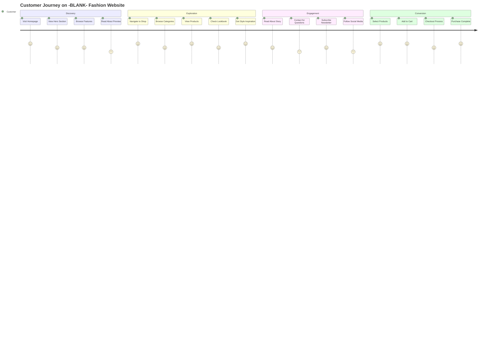
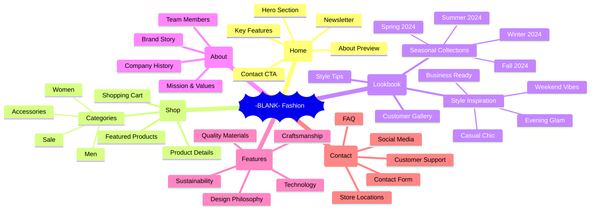
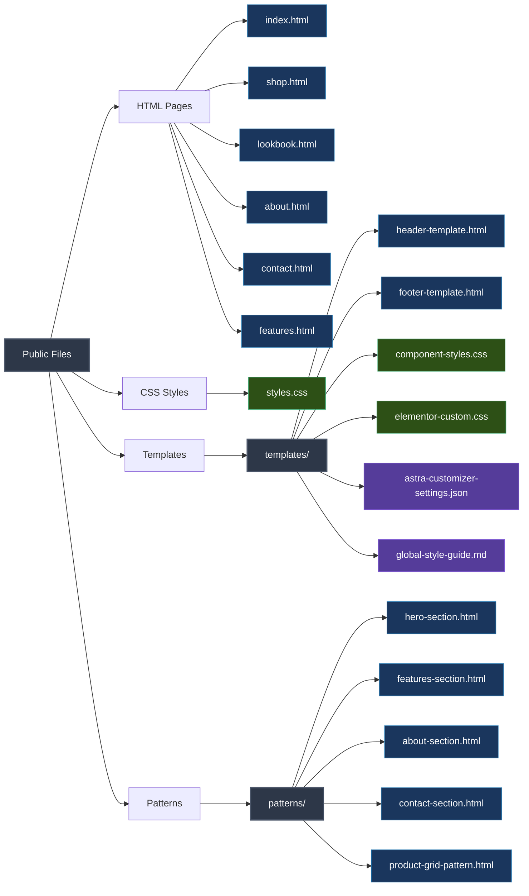

# -BLANK- Fashion Website Sitemap

## Site Architecture Overview

```mermaid
graph TD
    A[Home Page<br/>index.html] --> B[Shop<br/>shop.html]
    A --> C[Lookbook<br/>lookbook.html]
    A --> D[About<br/>about.html]
    A --> E[Contact<br/>contact.html]
    A --> F[Features<br/>features.html]
    
    %% Shop Sub-sections
    B --> B1[Product Categories<br/>#categories]
    B --> B2[Featured Products<br/>#featured]
    B --> B3[Product Grid<br/>#product-grid]
    
    %% Lookbook Sub-sections
    C --> C1[Seasonal Collections<br/>#seasonal]
    C --> C2[Featured Looks<br/>#looks]
    C --> C3[Style Tips<br/>#tips]
    C --> C4[Style Gallery<br/>#gallery]
    
    %% About Sub-sections
    D --> D1[Brand Story<br/>#story]
    D --> D2[Our Values<br/>#values]
    D --> D3[Team<br/>#team]
    
    %% Contact Sub-sections
    E --> E1[Contact Form<br/>#contact-form]
    E --> E2[Location Info<br/>#location]
    E --> E3[FAQ<br/>#faq]
    
    %% Features Sub-sections
    F --> F1[Core Features<br/>#core]
    F --> F2[Design Process<br/>#process]
    F --> F3[Technology<br/>#tech]
    F --> F4[Materials<br/>#materials]
    
    %% External Links
    A --> G[Newsletter Signup]
    A --> H[Social Media]
    A --> I[Customer Support]
    
    %% Template System
    J[Header Template] --> A
    J --> B
    J --> C
    J --> D
    J --> E
    J --> F
    
    K[Footer Template] --> A
    K --> B
    K --> C
    K --> D
    K --> E
    K --> F
    
    %% Style Classes
    classDef mainPage fill:#1a1a1a,stroke:#fff,stroke-width:2px,color:#fff
    classDef subSection fill:#333,stroke:#ccc,stroke-width:1px,color:#fff
    classDef template fill:#666,stroke:#fff,stroke-width:1px,color:#fff
    classDef external fill:#444,stroke:#999,stroke-width:1px,color:#fff
    
    class A,B,C,D,E,F mainPage
    class B1,B2,B3,C1,C2,C3,C4,D1,D2,D3,E1,E2,E3,F1,F2,F3,F4 subSection
    class J,K template
    class G,H,I external
```

## User Journey Flow

## Information Architecture

## Technical Site Structure

## Navigation Flow

```mermaid
flowchart TD
    Start([User Visits Site]) --> Home{Landing Page}
    
    Home --> |Explore Products| Shop[Shop Page]
    Home --> |Style Inspiration| Lookbook[Lookbook Page]
    Home --> |Learn About Brand| About[About Page]
    Home --> |Get in Touch| Contact[Contact Page]
    Home --> |View Features| Features[Features Page]
    
    Shop --> ShopActions{User Actions}
    ShopActions --> |Browse Categories| Categories[Product Categories]
    ShopActions --> |View Featured| Featured[Featured Products]
    ShopActions --> |Product Details| ProductPage[Individual Product]
    
    Lookbook --> LookActions{User Actions}
    LookActions --> |Seasonal Styles| Seasonal[Seasonal Collections]
    LookActions --> |Get Inspired| Inspiration[Featured Looks]
    LookActions --> |Learn Tips| Tips[Style Tips]
    LookActions --> |View Gallery| Gallery[Customer Gallery]
    
    About --> AboutActions{User Actions}
    AboutActions --> |Read Story| Story[Brand Story]
    AboutActions --> |Our Values| Values[Company Values]
    AboutActions --> |Meet Team| Team[Team Members]
    
    Contact --> ContactActions{User Actions}
    ContactActions --> |Send Message| Form[Contact Form]
    ContactActions --> |Find Location| Location[Store Info]
    ContactActions --> |Get Help| FAQ[FAQ Section]
    
    Features --> FeatureActions{User Actions}
    FeatureActions --> |Core Features| Core[Main Features]
    FeatureActions --> |Design Process| Process[How We Design]
    FeatureActions --> |Technology| Tech[Our Technology]
    FeatureActions --> |Materials| Materials[Quality Materials]
    
    %% All pages can lead to conversion
    Shop --> Conversion{Conversion Points}
    Lookbook --> Conversion
    About --> Conversion
    Contact --> Conversion
    Features --> Conversion
    
    Conversion --> |Newsletter| Newsletter[Email Signup]
    Conversion --> |Social Media| Social[Follow Us]
    Conversion --> |Purchase| Purchase[Buy Products]
    Conversion --> |Support| Support[Customer Service]
    
    %% Return to navigation
    Categories --> Home
    Featured --> Home
    Seasonal --> Home
    Inspiration --> Home
    Story --> Home
    Form --> Home
    
    %% Styling
    classDef startEnd fill:#e53e3e,stroke:#c53030,stroke-width:2px,color:#fff
    classDef mainPage fill:#3182ce,stroke:#2c5aa0,stroke-width:2px,color:#fff
    classDef decision fill:#38a169,stroke:#2f855a,stroke-width:2px,color:#fff
    classDef action fill:#805ad5,stroke:#6b46c1,stroke-width:1px,color:#fff
    classDef conversion fill:#d69e2e,stroke:#b7791f,stroke-width:2px,color:#fff
    
    class Start startEnd
    class Home,Shop,Lookbook,About,Contact,Features mainPage
    class ShopActions,LookActions,AboutActions,ContactActions,FeatureActions,Conversion decision
    class Categories,Featured,ProductPage,Seasonal,Inspiration,Tips,Gallery,Story,Values,Team,Form,Location,FAQ,Core,Process,Tech,Materials action
    class Newsletter,Social,Purchase,Support conversion
```

## Content Hierarchy

```mermaid
graph TB
    A[Site Header] --> B[Main Navigation]
    B --> B1[Home]
    B --> B2[Shop] 
    B --> B3[Lookbook]
    B --> B4[About]
    B --> B5[Contact]
    B --> B6[Features]
    
    C[Page Content] --> D[Hero Section]
    C --> E[Main Content Sections]
    C --> F[Call-to-Action Areas]
    
    G[Site Footer] --> H[Quick Links]
    G --> I[Customer Care]
    G --> J[Social Media]
    G --> K[Newsletter Signup]
    
    %% Content depth levels
    E --> E1[Primary Content]
    E --> E2[Secondary Content]
    E --> E3[Supporting Elements]
    
    E1 --> E1a[Headlines]
    E1 --> E1b[Key Messages]
    E1 --> E1c[Product Features]
    
    E2 --> E2a[Descriptions]
    E2 --> E2b[Benefits]
    E2 --> E2c[Details]
    
    E3 --> E3a[Images]
    E3 --> E3b[Icons]
    E3 --> E3c[Testimonials]
    
    classDef header fill:#1a202c,stroke:#2d3748,stroke-width:2px,color:#fff
    classDef content fill:#2a4365,stroke:#3182ce,stroke-width:2px,color:#fff
    classDef footer fill:#1a202c,stroke:#2d3748,stroke-width:2px,color:#fff
    classDef primary fill:#2b6cb0,stroke:#3182ce,stroke-width:1px,color:#fff
    classDef secondary fill:#4299e1,stroke:#63b3ed,stroke-width:1px,color:#fff
    classDef supporting fill:#90cdf4,stroke:#bee3f8,stroke-width:1px,color:#000
    
    class A,B header
    class C,D,E,F content
    class G,H,I,J,K footer
    class E1,E1a,E1b,E1c primary
    class E2,E2a,E2b,E2c secondary
    class E3,E3a,E3b,E3c supporting
```

This comprehensive sitemap provides multiple views of the -BLANK- Fashion website structure, including navigation flow, user journeys, technical architecture, and content hierarchy. It's perfect for understanding the complete site ecosystem and planning future enhancements.
